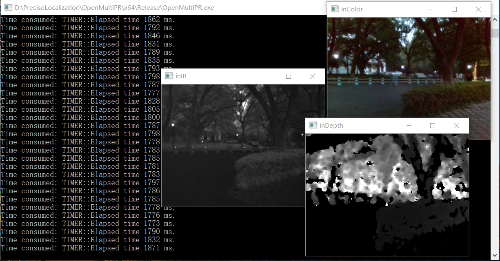

# Open Multimodal Place Recognition

## Paper
If you are using this code in your research, please cite the papers:\
Cheng, Ruiqi, et al. "**OpenMPR: Recognize places using multimodal data for people with visual impairments.**" Measurement Science and Technology (2019). https://doi.org/10.1088/1361-6501/ab2106

## Environment
Visual Studio 2017 on Windows 10

## Dependencies
*OpenCV 4.0 (64 bit)*: set OpenCV path as OpenCV_DIR in system environments\
*DBoW3*: set DBoW3 path as DBoW3_DIR in system environments\
*FFTW3*: set FFTW path as FFTW_DIR in system environments

## Additional Files
The pre-trained model of CNN could be downloaded at [GoogLeNet-Places365](https://drive.google.com/file/d/1bB4eIGdq63UHZJBKOqL2PKHrSOuJ3rRy/view?usp=sharing), which should be unzipped to the source code folder.

## Dataset
The dataset is available at [Multimodal Dataset](https://drive.google.com/file/d/1NuRUaZA_g0rBzJXYLqy4RlgZw7OGDvnv/view?usp=sharing).

## Conguration File
The configuration file `Config.yaml` is in the folder of `OpenMultiPR`. In the yaml file, the dataset and BoW vocabulary paths are assigned. Other parameters could also be switched, the detailed information is labeled in `Config.yaml`. 